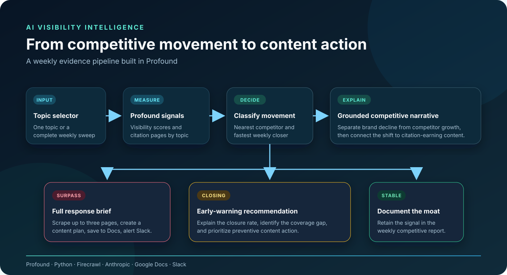
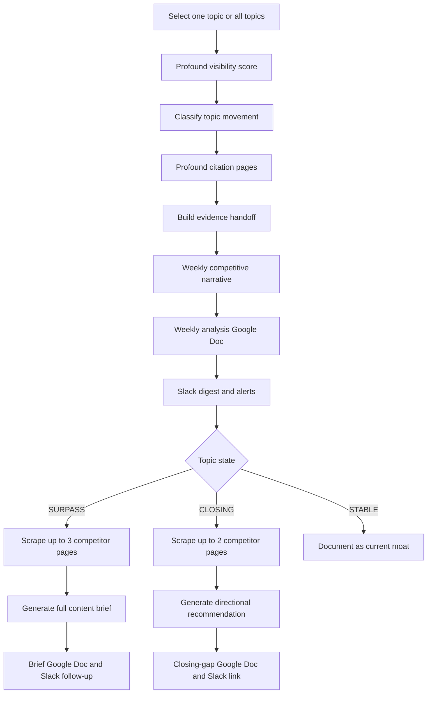

# AI Visibility Competitor Monitor

**Detect competitive shifts in AI search visibility, explain what is driving them, and turn the evidence into a content response.**

This Profound workflow monitors a brand and its competitive set by topic. It separates routine movement from emerging threats, traces competitor gains to the pages earning citations, and produces a weekly decision package for the content team.



_Architecture derived from the sanitized workflow export. Brand, account, topic, and integration details are intentionally anonymized._

## The business problem

AI visibility reporting can show that a competitor moved, but a content team still needs to answer three harder questions:

1. Did the competitor actually overtake us, or are they only gaining ground?
2. Which cited pages appear to be driving that movement?
3. What should we create or improve in response?

This workflow connects those questions in one operating loop. It does not publish content automatically; it gives a marketer the evidence, recommendation, and draft brief needed to make the next decision.

## What it does

The workflow can scan one selected topic or run a full weekly sweep.

| Stage | What happens |
|---|---|
| Measure | Pulls 14 days of weekly AI-visibility data from Profound for the primary brand and five competitors |
| Classify | Separates topics into `SURPASS`, `CLOSING`, and `STABLE` states |
| Investigate | Retrieves citation-earning competitor pages by topic and scrapes the strongest available evidence |
| Explain | Produces a quantitative weekly competitive narrative grounded in the supplied visibility and page data |
| Recommend | Creates full briefs for surpassed topics and lighter preventive recommendations for closing-gap topics |
| Deliver | Creates Google Docs and sends a Slack digest, alerts, recommendations, and document links |

## Decision logic

The thresholds in the public template are configurable:

- **SURPASS:** the nearest competitor leads the primary brand by at least `0.05` percentage points.
- **CLOSING:** the primary brand still leads, but the fastest-moving competitor is gaining at least `0.30` percentage points per week relative to the brand.
- **STABLE:** neither condition is present.

The workflow tracks both the nearest competitor by current score and the fastest closer by weekly movement. They are not always the same company, so the content response is based on the threat that actually triggered the state.

## What the workflow produces

### Weekly analysis

The main report contains:

- An executive summary of the most consequential movement.
- Topic-level analysis distinguishing brand decline from competitor growth.
- The citation-earning pages that may explain the change.
- Patterns in competitor content formats and positioning.
- Topics most exposed over the next several weeks.
- Five prioritized content actions.

### Response for a `SURPASS` topic

For each topic where a competitor is already ahead, the workflow evaluates as many as three cited pages and generates a full brief containing:

- Recommended content type and differentiated angle.
- Three working titles.
- An eight-to-twelve-section outline.
- Relevant proof points and sourcing guidance.
- AI-citation depth requirements.
- Target questions the new content should win.
- Internal-linking and distribution recommendations.

Each brief is saved as its own Google Doc and sent to Slack.

### Response for a `CLOSING` topic

For each emerging threat, the workflow evaluates up to two competitor pages and creates a shorter recommendation: what is moving, the likely content gap, three to five actions, and a low/medium/high urgency rating. Those recommendations are collected into one Google Doc.

## Example classification

The figures below are fictional and only illustrate the operating logic.

| Topic | Primary brand | Leading competitor | Weekly closure rate | State | Response |
|---|---:|---:|---:|---|---|
| Example Topic 01 | 16.8 pp | 18.1 pp | — | `SURPASS` | Create a full content brief |
| Example Topic 02 | 22.4 pp | 20.9 pp | 0.7 pp/week | `CLOSING` | Produce an early-warning recommendation |
| Example Topic 03 | 19.5 pp | 16.0 pp | 0.1 pp/week | `STABLE` | Retain in the weekly analysis |

## Workflow map



## Install and configure

### Requirements

- A Profound workspace with access to the agent or workflow builder.
- Profound visibility-score and citation-page data.
- Firecrawl for page extraction.
- An Anthropic model connection.
- Google Docs and Slack connections for delivery.

The public export contains no working credentials or account identifiers.

### 1. Clone the repository

```bash
git clone https://github.com/Jlopez-nava/ai-visibility-competitor-monitor.git
cd ai-visibility-competitor-monitor
```

### 2. Import the workflow

Use the sanitized template at:

```text
workflow/weekly-competitor-monitor.json
```

Import it through the workflow-import option available in your Profound workspace. If your workspace does not expose direct JSON import, use the export as the node-by-node configuration reference.

### 3. Replace the public placeholders

Before running the workflow, configure these values inside Profound:

1. Replace the redacted Profound category ID.
2. Replace `Primary Brand` and the five example competitors with your own asset names.
3. Replace the `.example` competitor domains in the Profound filters and Python domain maps.
4. Replace the example topic-selector values with your monitored topics.
5. Replace generic positioning and proof-point placeholders in the three model prompts.
6. Reconnect Firecrawl, Anthropic, Google Docs, and Slack through Profound's integration controls.
7. Select the intended Slack channel inside Profound rather than inserting a channel identifier into the repository.

### 4. Test safely

Run a single topic first. Confirm that:

- Visibility scores use percentage points consistently.
- Citation pages match the selected topic.
- Missing citation evidence is clearly labeled as a lower-confidence fallback.
- The weekly analysis document is created correctly.
- Slack messages go only to a test channel.
- Generated briefs contain supported claims and working source links.

After validation, configure the weekly schedule in the Profound workspace. Scheduling is not included in this JSON export.

## Evidence and safety design

- The language-model nodes have web search disabled; their recommendations are grounded in the workflow's Profound and Firecrawl inputs.
- The public workflow does not publish or edit website content.
- Missing topic-specific citation evidence is kept empty instead of silently borrowing pages from another topic.
- Homepage fallbacks are identified so the model can lower confidence.
- Iteration errors continue with defaults so one failed topic does not stop the full report.
- Content and alerts still require human review before execution.

## Public-repository boundaries

This repository intentionally excludes:

- API keys, tokens, credentials, and webhooks.
- Profound category and account identifiers.
- Google Docs and Slack integration identifiers.
- Slack channel identifiers.
- Real employer, customer, or competitor strategy data.
- Internal topic taxonomies, positioning, proof points, and performance claims.
- Generated Google Docs, Slack messages, or live run data.

The included JSON uses synthetic graph identifiers, placeholder integrations, generic topics, and reserved `.example` domains. It is a safe configuration template, not a connected production agent.

## Known operating considerations

- Thresholds should be calibrated to the normal variance of the selected Profound category.
- When fewer cited pages are available than the scraper expects, the workflow may use a homepage fallback more than once.
- Generated analysis is only as reliable as the visibility data, page matching, and source content supplied to the model.
- Real company data passes through the configured Profound, Firecrawl, model, Google, and Slack services; review their access scopes and data policies before production use.

## Project map

```text
workflow/weekly-competitor-monitor.json  Sanitized Profound workflow export
assets/workflow-architecture.svg        Public-safe architecture visual
SECURITY.md                              Safe-use and disclosure guidance
README.md                                Case study and configuration guide
```

## Built with

`Profound` · `Python` · `Firecrawl` · `Anthropic` · `Google Docs` · `Slack`

